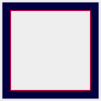
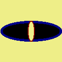
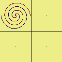
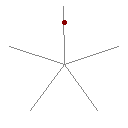
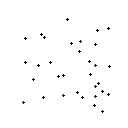

The following animated GIFs have been generated with the code samples present in this folder. The corresponding GIF files are available in the `res` folder.
**Note**: Depending on your settings and browser, you may need to click on them or hit play to begin playback.

|Description|GIF|
|---|:---:|
|**first.rb**  First example from the main readme. Here we test some of the basic features of the GIF format, including animation, transparency, disposal method, etc.||
|**clock.rb**  Several methods from the `Geometry` module are used here to perform auxiliary calculations. We also test some more drawing primitives, such as lines.||
|**anchor.rb**  Experimenting with different `anchoring` settings for a rectangle's border. This controls whether the border is drawn inside the rectangle's boundary, outside it, centered, or any inbetween. The default is inside.||
|**circles.rb**  Experimenting with different `style` settings for a circle's border. This controls whether the border is drawn either as concentric circles (`:smooth`, bottom right) or by subsequently adding grid layers around the inner border (`:grid`, top left). The default is `:smooth`.||
|**ellipses.rb**  Some more drawing primitives. Morphing ellipses with border.||
|**spirals.rb**  Gifenc allows to trace parametric curves. In this example, we trace 4 similar archimedean spirals, morphing them in different ways (rotating, scaling, tracing, and all 3 of them). ||
|**star.rb**  Tracing of a pointed star. This example showcases another geometrica tool: reflections, since we trace each side by progressively reflecting a vertex about one of the star's diagonals. ||
|**hull.rb**  Tracing the convex hull of a random sample of points, and using the flood fill / bucket tool to color the interior once the trace is done. We also plot the center of mass of the points at the end.||