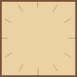

The following GIFs have been generated with the code samples present in this folder. The corresponding GIF files are available in the `res` folder.

|Description|GIF|
|---|:---:|
|**first.rb**  First example from the main readme. Here we test some of the basic features of the GIF format, including animation, transparency, disposal method, etc.||
|**clock.rb**  Several methods from the `Geometry` module are used here to perform auxiliary calculations. We also test some more drawing primitives, such as lines.||
|**anchor.rb**  Experimenting with different `anchoring` settings for a rectangle's border. This controls whether the border is drawn inside the rectangle's boundary, outside it, centered, or any inbetween. The default is inside.||